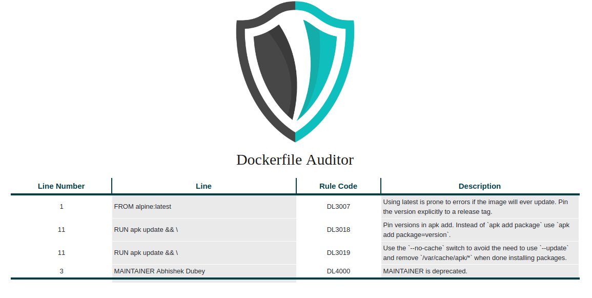

[](https://circleci.com/gh/iamabhishek-dubey/dockerlinter) 
[](https://goreportcard.com/report/github.com/iamabhishek-dubey/dockerlinter)
[](LICENSE)
[](https://github.com/iamabhishek-dubey/dockerlinter/releases/latest)
# Dockerlinter


## Introduction

A simple golang tool which audits your Dockerfile with Best Practices and generates a HTML report. The main goal of creating this tool is to provide easy, fast and reliable linting of Dockerfile.

## Supported OS Distribution
This OS Family which we are supporting right now is:-

- [X] **RedHat Family(Including CentOS)**
- [X] **Debian Family(All)**

## Requirments
The requirements for using this tools are:-

- **Golang**
- **Docker(If you are running Dockerized Setup)**

## Parameters
Here is the list of parameters which is accepted by this tool.

|**Parameter**|**Supported Values**|**Description**|
|-------------|--------------------|---------------|
|--ignore | code Ex:- dl3000 | Provide the rule code which you want to ignore |
|--version | - | It will print the version of dockerlinter. |

## How to Use
This tool is pretty much straight forward for use. We have categorized it in two parts i.e. **Manual Setup** and **Dockerized Setup**

```shell
git clone https://github.com/iamabhishek-dubey/dockerlinter.git
cd dockerlinter
make get-depends
make build-code
```

### Dockerized Setup
Steps for Dockerized Setup

```shell
make build-image
docker run -itd --name docker-linter docker-linter:latest
```

## Running dockerlinter
After running setup, you just need to execute a simple binary. For example:-

```shell
dockerlinter Dockerfile
```

## Example Reports

We are generating reports in two ways one is HTML and other one is Table.

- **Table Report**

```shell
+-------------+--------------------------------+-----------+--------------------------------+
| LINE NUMBER |              LINE              | RULE CODE |          DESCRIPTION           |
+-------------+--------------------------------+-----------+--------------------------------+
| 1           | FROM alpine:latest             | DL3007    | Using latest is prone to       |
|             |                                |           | errors if the image will       |
|             |                                |           | ever update. Pin the version   |
|             |                                |           | explicitly to a release tag.   |
+-------------+--------------------------------+-----------+--------------------------------+
| 11          | RUN apk update && \            | DL3018    | Pin versions in apk add.       |
|             |                                |           | Instead of `apk add package`   |
|             |                                |           | use `apk add package=version`. |
+-------------+--------------------------------+-----------+--------------------------------+
| 11          | RUN apk update && \            | DL3019    | Use the `--no-cache` switch    |
|             |                                |           | to avoid the need to use       |
|             |                                |           | `--update` and remove          |
|             |                                |           | `/var/cache/apk/*` when done   |
|             |                                |           | installing packages.           |
+-------------+--------------------------------+-----------+--------------------------------+
| 3           | MAINTAINER Abhishek Dubey      | DL4000    | MAINTAINER is deprecated.      |
|             | <abhishek.dubey@opstree.com>   |           |                                |
+-------------+--------------------------------+-----------+--------------------------------+
```

- **HTML Report**



## Rules
For rules, we have taken the refrence from **[hadolint](https://github.com/hadolint/hadolint)**. Here is the list of rules which we are implementing:-

| Rule                                                         | Description                                                                                                                                         |
|:-------------------------------------------------------------|:----------------------------------------------------------------------------------------------------------------------------------------------------|
| [DL3000](https://github.com/hadolint/hadolint/wiki/DL3000)   | Use absolute WORKDIR.                                                                                                                               |
| [DL3001](https://github.com/hadolint/hadolint/wiki/DL3001)   | For some bash commands it makes no sense running them in a Docker container like ssh, vim, shutdown, service, ps, free, top, kill, mount, ifconfig. |
| [DL3002](https://github.com/hadolint/hadolint/wiki/DL3002)   | Last user should not be root.                                                                                                                       |
| [DL3003](https://github.com/hadolint/hadolint/wiki/DL3003)   | Use WORKDIR to switch to a directory.                                                                                                               |
| [DL3004](https://github.com/hadolint/hadolint/wiki/DL3004)   | Do not use sudo as it leads to unpredictable behavior. Use a tool like gosu to enforce root.                                                        |
| [DL3005](https://github.com/hadolint/hadolint/wiki/DL3005)   | Do not use apt-get upgrade or dist-upgrade.                                                                                                         |
| [DL3006](https://github.com/hadolint/hadolint/wiki/DL3006)   | Always tag the version of an image explicitly.                                                                                                      |
| [DL3007](https://github.com/hadolint/hadolint/wiki/DL3007)   | Using latest is prone to errors if the image will ever update. Pin the version explicitly to a release tag.                                         |
| [DL3008](https://github.com/hadolint/hadolint/wiki/DL3008)   | Pin versions in apt-get install.                                                                                                                    |
| [DL3009](https://github.com/hadolint/hadolint/wiki/DL3009)   | Delete the apt-get lists after installing something.                                                                                                |
| [DL3010](https://github.com/hadolint/hadolint/wiki/DL3010)   | Use ADD for extracting archives into an image.                                                                                                      |
| [DL3011](https://github.com/hadolint/hadolint/wiki/DL3011)   | Valid UNIX ports range from 0 to 65535.                                                                                                             |
| [DL3012](https://github.com/hadolint/hadolint/wiki/DL3012)   | Provide an email address or URL as maintainer.                                                                                                      |
| [DL3013](https://github.com/hadolint/hadolint/wiki/DL3013)   | Pin versions in pip.                                                                                                                                |
| [DL3014](https://github.com/hadolint/hadolint/wiki/DL3014)   | Use the `-y` switch.                                                                                                                                |
| [DL3015](https://github.com/hadolint/hadolint/wiki/DL3015)   | Avoid additional packages by specifying --no-install-recommends.                                                                                    |
| [DL3016](https://github.com/hadolint/hadolint/wiki/DL3016)   | Pin versions in `npm`.                                                                                                                              |
| [DL3017](https://github.com/hadolint/hadolint/wiki/DL3017)   | Do not use `apk upgrade`.                                                                                                                           |
| [DL3018](https://github.com/hadolint/hadolint/wiki/DL3018)   | Pin versions in apk add. Instead of `apk add <package>` use `apk add <package>=<version>`.                                                          |
| [DL3019](https://github.com/hadolint/hadolint/wiki/DL3019)   | Use the `--no-cache` switch to avoid the need to use `--update` and remove `/var/cache/apk/*` when done installing packages.                        |
| [DL3020](https://github.com/hadolint/hadolint/wiki/DL3020)   | Use `COPY` instead of `ADD` for files and folders.                                                                                                  |
| [DL3021](https://github.com/hadolint/hadolint/wiki/DL3021)   | `COPY` with more than 2 arguments requires the last argument to end with `/`                                                                        |
| [DL3022](https://github.com/hadolint/hadolint/wiki/DL3022)   | `COPY --from` should reference a previously defined `FROM` alias                                                                                    |
| [DL3023](https://github.com/hadolint/hadolint/wiki/DL3023)   | `COPY --from` cannot reference its own `FROM` alias                                                                                                 |
| [DL3024](https://github.com/hadolint/hadolint/wiki/DL3024)   | `FROM` aliases (stage names) must be unique                                                                                                         |
| [DL3025](https://github.com/hadolint/hadolint/wiki/DL3025)   | Use arguments JSON notation for CMD and ENTRYPOINT arguments                                                                                        |
| [DL3026](https://github.com/hadolint/hadolint/wiki/DL3026)   | Use only an allowed registry in the FROM image                                                                                                      |
| [DL4000](https://github.com/hadolint/hadolint/wiki/DL4000)   | MAINTAINER is deprecated.                                                                                                                           |
| [DL4001](https://github.com/hadolint/hadolint/wiki/DL4001)   | Either use Wget or Curl but not both.                                                                                                               |
| [DL4003](https://github.com/hadolint/hadolint/wiki/DL4003)   | Multiple `CMD` instructions found.                                                                                                                  |
| [DL4004](https://github.com/hadolint/hadolint/wiki/DL4004)   | Multiple `ENTRYPOINT` instructions found.                                                                                                           |
| [DL4005](https://github.com/hadolint/hadolint/wiki/DL4005)   | Use `SHELL` to change the default shell.                                                                                                            |
| [DL4006](https://github.com/hadolint/hadolint/wiki/DL4006)   | Set the `SHELL` option -o pipefail before `RUN` with a pipe in it|

## Todo
- [X] Remove temporary files
- [X] Publish table output on terminal
- [ ] Add more linting rules
