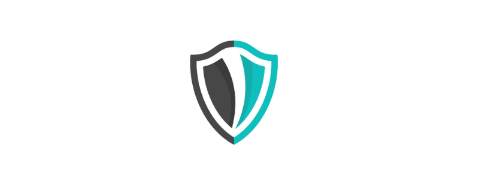

# Dockerlinter

## Introduction

A simple golang tool which audits your Dockerfile with Best Practices and generates a HTML report. The main goal of creating this tool is to provide easy, fast and reliable linting of Dockerfile.

## Supported OS Distribution
This OS Family which we are supporting right now is:-

- [X] **RedHat Family(Including CentOS)**
- [X] **Debian Family(All)**

## Requirments
The requirements for using this tools are:-

- **Golang**
- **Docker(If you are running Dockerized Setup)**

## Parameters
Here is the list of parameters which is accepted by this tool.

|**Parameter**|**Supported Values**|**Description**|
|-------------|--------------------|---------------|
|--ignore | code Ex:- dl3000 | Provide the rule code which you want to ignore |
|--version | - | It will print the version of dockerlinter. |
